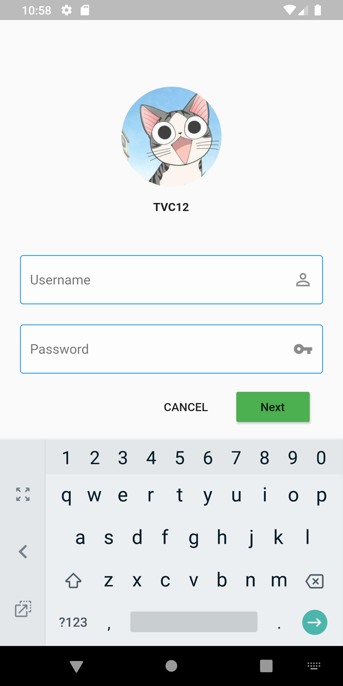

## example_flutter_material

A Flutter example project with material component


[](http://hits.dwyl.io/tvc/example_flutter_material)


### Getting Started

This project is a starting point for a Flutter application.

A few resources to get you started if this is your first Flutter project:

- [Lab: Write your first Flutter app](https://flutter.dev/docs/get-started/codelab)
- [Cookbook: Useful Flutter samples](https://flutter.dev/docs/cookbook)

For help getting started with Flutter, view our 
[online documentation](https://flutter.dev/docs), which offers tutorials, 
samples, guidance on mobile development, and a full API reference.

- Clone this project:

```bash
git clone https://github.com/tvc12/example_flutter_material.git
cd example_flutter_material
```

- Get packages from **pub** for Flutter app:

```bash
flutter packages get
```

- Run project:

```bash
flutter run
```

### Sreenshoots



### Contributors

| [](https://github.com/tvc12) | 
| :---: |
| [Thien Chi Vi](https://github.com/tvc12) | 
